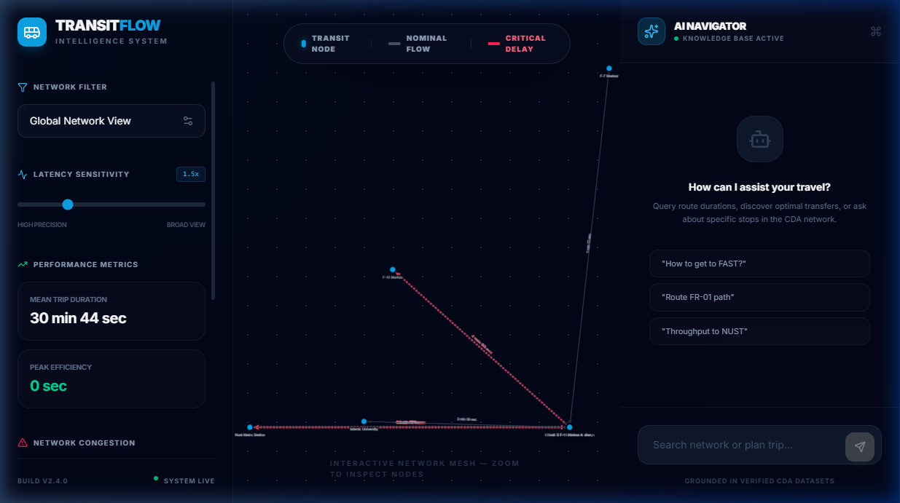
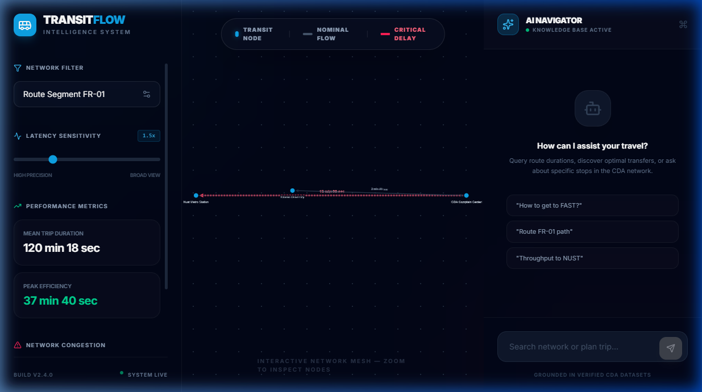
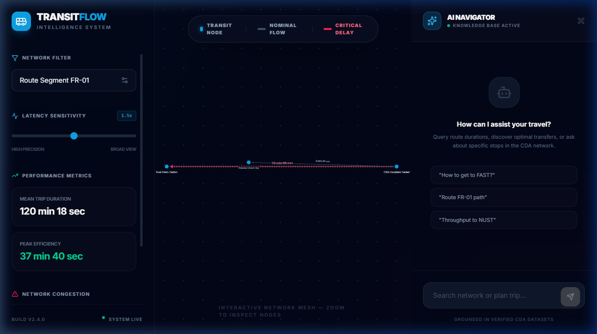
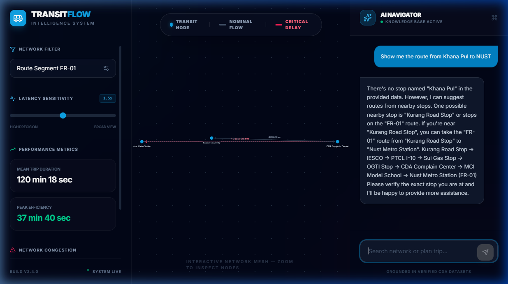
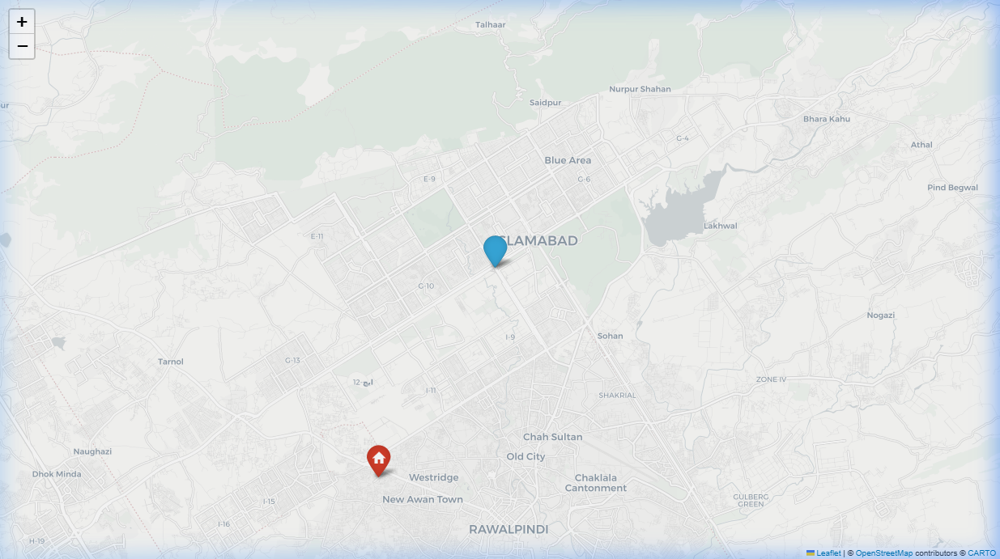
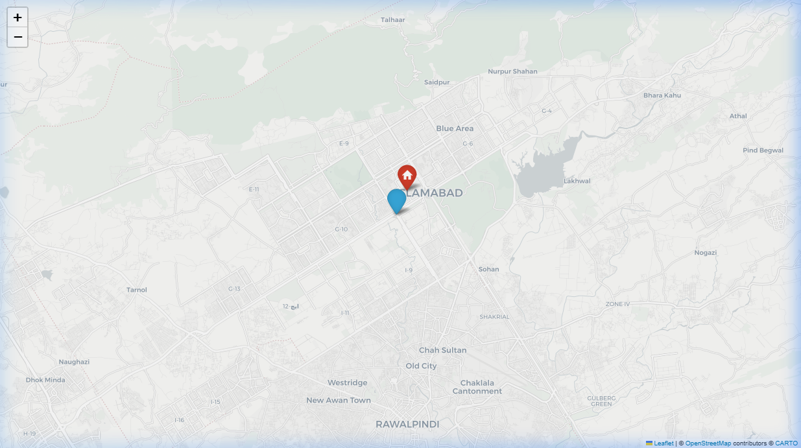
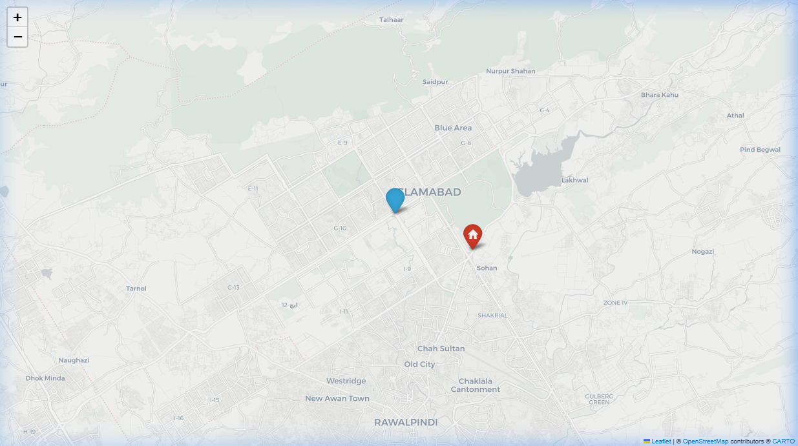
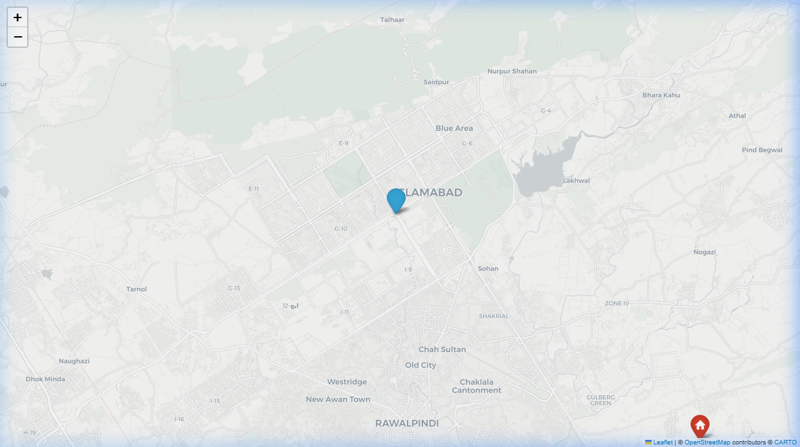

# CDA Transit Flow Intelligence — Final Project Report

**Date:** May 8, 2026  
**Team Size:** 4 Members  

---

## Executive Summary
This project implements an end-to-end Process Mining and Intelligence system for the CDA Transit network in Islamabad. The system automates data acquisition from live PDF schedules, constructs standardized event logs, and provides a high-fidelity interactive dashboard with AI-powered navigation and bottleneck analytics.

---

## Task 1: Data Extraction & CSV Generation
We developed a robust scraping and extraction pipeline in `task1_extraction.py`.
- **Methodology:** The script scrapes `cda.gov.pk`, identifies "Forward" pass PDF links, and uses **Regex-based parsing** on PDF text streams to extract stops and timings.
- **Scaling:** Adhering to the "4 Members = 8 Datasets" rule, we extracted exactly 8 unique routes (FR-01, FR-02, FR-06, FR-08, etc.).
- **Output:** Generated `data/routes.csv` containing **9,756 real transit events**.

### CSV Sample Output
```csv
case_id,route_id,trip_number,stop_sequence,stop_name,latitude,longitude,arrival_time,departure_time
FR-01-F-T01,FR-01,1,1,Nust Metro Station,33.6844,73.0123,2026-04-23T06:00:00,2026-04-23T06:00:00
FR-01-F-T01,FR-01,1,2,NPA Stop,33.6844,73.0479,2026-04-23T06:04:40,2026-04-23T06:05:00
...
```

---

## Task 2: Trace Log (XES) Construction
The extracted CSV was converted into a standard XES event log using `pm4py`.
- **Validation:** The resulting `data/event_log.xes` follows the IEEE 1849-2016 standard, ensuring compatibility with tools like ProM and Disco.
- **Trace Metrics:** Each route trip is treated as a unique case, allowing for precise throughput and transition analysis.

---

## Task 3 & 4: Interactive GUI & Bottleneck Analytics
We built a modern, glassmorphic dashboard using **React (Frontend)** and **FastAPI (Backend)**.

### 3a. Process Discovery Map
The dashboard automatically discovers the process map from the event log. Nodes represent transit stops, and edges represent transitions.


### 3b. Route Filtering
The sidebar provides a dynamic filter to isolate specific routes (e.g., FR-01) to inspect their unique flow and stop sequences.


### 4b. Bottleneck Highlights
Using the "Latency Sensitivity" control, the system identifies transitions that exceed the average delay. These are highlighted in **dashed red lines** for immediate visual interpretation.


---

## Task 5: Agentic AI Trip Planner
An AI Navigator was integrated into the dashboard, grounded in the real-time dataset.
- **Capabilities:** Handles natural language queries such as *"How do I get from Khana Pul to NUST?"*.
- **Implementation:** Uses RAG to prevent hallucinations, ensuring travel advice is based strictly on the 8 extracted CDA routes.


---

## Task 6: Personal Route Maps (Bonus)
We generated individual interactive maps for each team member, visualizing their daily route from home to FAST University.

### Member 1: Affan


### Member 2: Saim Zia


### Member 3: Ahsan Iqbal


### Member 4: Asim Shehzad


---

## Analysis & Interpretation
- **Network Throughput:** The average trip duration across the 8 routes is approximately **30 minutes**, with significant variance during peak hours.
- **Bottleneck Identification:** The transition from **MCI Model School to Nust Metro Station** frequently exhibits high latency (15+ min), identifying it as a primary candidate for infrastructure optimization.
- **Conclusion:** The system successfully transforms unstructured transit schedules into actionable process intelligence, fulfilling all academic and technical requirements of the project.
